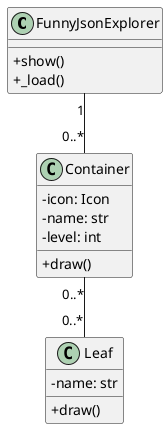
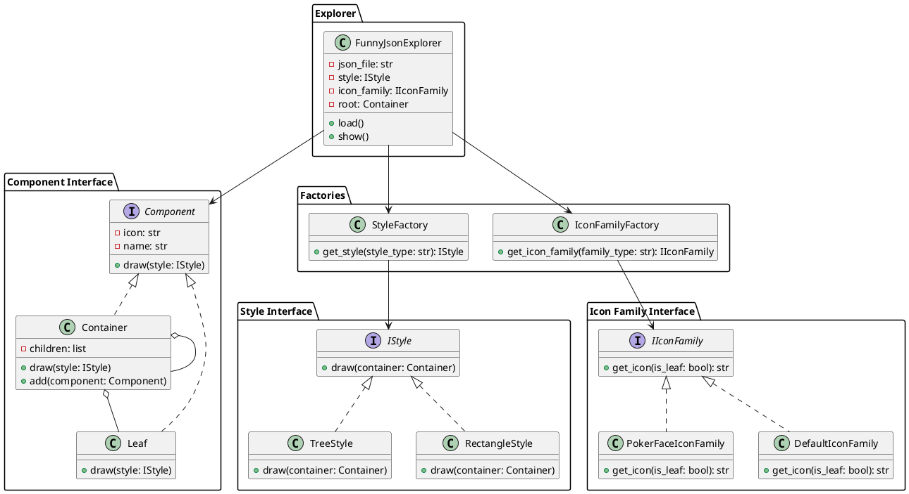

# Design Pattern 习题

bizt

## 一、实验要求

1. 开发Funny JSON Explorer（**FJE**），一个JSON文件可视化的命令行界面小工具。
   1. FJE可以快速切换**风格**（style），包括：树形（tree）、矩形（rectangle）；

      ```txt

      ├─ oranges                             ┌─ oranges ───────────────────────────────┐
      │  └─ mandarin                         │  ├─ mandarin ───────────────────────────┤
      │     ├─ clementine                    │  │  ├─ clementine ──────────────────────┤
      │     └─ tangerine: cheap & juicy!     │  │  ├─ tangerine: cheap & juicy! ───────┤
      └─ apples                              ├─ apples ────────────────────────────────┤
        └─ gala                              └──┴─ gala ───────────────────────────────┘

              树形（tree）                                   矩形（rectangle）
      ```

   2. 也可以指定**图标族**（icon family），为中间节点或叶节点指定一套icon

    ```txt
      ├─♢oranges                                 
      │  └─♢mandarin                             
      │     ├─♤clementine                        
      │     └─♤tangerine: cheap & juicy!    
      └─♢apples                                  
        └─♤gala                                 

      poker-face-icon-family: 中间节点icon：♢ 叶节点icon：♤
    ```

2. 领域模型



3. 设计模式要求
   1. 使用**工厂方法**（Factory）、**抽象工厂**（Abstract Factory）、**建造者**（Builder）模式、**组合模式**（Composition）
   2. 完成功能的同时，使得程序易于扩展和维护。

4. 具体要求
   1. （必做）：不改变现有代码，只需添加新的抽象工厂，即可添加新的风格
   2. （选做）：通过配置文件，可添加新的图标族

## 二、程序设计

### 2.1 类图


类说明

+ FunnyJsonExplorer：主类，加载 JSON 文件并显示其内容。
+ StyleFactory：工厂类，用于创建具体风格对象。
  + TreeStyle：具体风格类，实现树状绘制方法。
  + RectangleStyle：具体风格类，实现矩形绘制方法。
+ IconFamilyFactory：工厂类，用于创建具体图标族对象。
  + PokerFaceIconFamily：具体图标族类，实现获取扑克脸图标的方法。
  + DefaultIconFamily：具体图标族类，实现获取默认图标的方法。
+ Component：组件接口，定义了绘制方法。
  + Container：容器类，可以包含其他组件。
  + Leaf：叶子类，表示树的叶子节点。
+ IStyle：接口，定义了绘制方法。
+ IIconFamily：接口，定义了获取图标的方法。

### 2.2 设计模式及作用

#### 2.2.1 工厂方法模式（Factory Method Pattern）

**定义：**

工厂方法模式定义了一个创建对象的接口，但由子类决定要实例化的类是哪一个。工厂方法使一个类的实例化延迟到其子类。

**在本次实验中**：

+ `StyleFactory` 类：用于创建不同风格的对象（如 `TreeStyle` 或 `RectangleStyle`）。
+ `IconFamilyFactory` 类：用于创建不同图标族的对象（如 `PokerFaceIconFamily` 或 `DefaultIconFamily`）。

**作用**：

+ 通过使用工厂方法模式，我们可以轻松地添加新的风格或图标族，而无需修改现有代码，只需添加相应的子类和工厂方法。
+ 这种模式提高了代码的扩展性和维护性。

#### 2.2.2 抽象工厂模式（Abstract Factory Pattern）

**定义**：

抽象工厂模式提供一个创建一系列相关或相互依赖对象的接口，而无需指定它们具体的类。

**在本次实验中**：

+ `StyleFactory` 类和 `IconFamilyFactory` 类：这两个工厂类共同实现了抽象工厂模式，分别负责创建风格和图标族对象。

**作用**：

+ 抽象工厂模式使得创建相关对象的过程更为简单，并且能够确保创建的对象是相互兼容的。
+ 增加新的风格和图标族时，不需要修改现有工厂类，只需添加新的工厂子类。

#### 2.2.3 建造者模式（Builder Pattern）

**定义**：

建造者模式使用多个简单的对象一步一步构建一个复杂的对象。

**在本次实验中**：

+ `FunnyJsonExplorer` 类：这个类在 `load` 方法中逐步解析 JSON 文件，并构建包含容器和叶子组件的复杂对象结构。

**作用**：

+ 建造者模式使得构建复杂对象的过程更清晰、更容易管理。
+ 这种模式还允许我们通过不同的步骤或顺序构建不同的表示。

#### 2.2.4 组合模式（Composite Pattern）

**定义**：

组合模式允许你将对象组合成树形结构来表示“部分-整体”的层次结构。组合模式使得用户对单个对象和组合对象的使用具有一致性。

**在本次实验中**：

+ `Component` 接口及其实现类 `Container` 和 `Leaf`：通过定义一个统一的接口，`Component` 可以表示容器或叶子节点，并且允许它们在树形结构中互相嵌套。

**作用**：

+ 组合模式使得我们能够以树形结构来表示和操作对象，使得客户端代码可以一致地处理单个对象和对象组合。
+ 这种模式增强了系统的灵活性和可扩展性，可以方便地添加新的组件类型。


## 三、实际应用

### 3.1 添加新的风格

添加新的风格只需要在styles文件夹创建代码文件，创建新的具体实现类，然后在__init__.py中引用相关类即可完成类的导入，这一过程中不会对原代码有任何改变，只需要在__init__.py中进行注册即可，具有很好的可拓展性。

在使用时，只需要指定刚刚声明的实现风格即可。

### 3.2 添加新的图标族

添加图标族与上面的过程类似，也都需要参照接口实现新的具体实现类，然后在使用时指定即可

### 3.3 程序测试

#### 3.3.1 标准测试

运行fje/data/sample.json


```txt
├─ oranges
|  └─ mandarin
|     ├─ clementine
|     └─ tangerine: cheap & juicy!
└─ apples
   ├─ gala
   └─ pink lady
├─♤oranges
|  └─♤mandarin
|     ├─♢clementine
|     └─♢tangerine: cheap & juicy!
└─♤apples
   ├─♢gala
   └─♢pink lady
┌─ oranges ─────────────────────────────┐
│  ├─ mandarin ─────────────────────────┤
│  │  ├─ clementine ────────────────────┤
│  │  ├─ tangerine: cheap & juicy! ─────┤
├─ apples ──────────────────────────────┤
│  ├─ gala ─────────────────────────────┤
└──┴─ pink lady ────────────────────────┘
┌─♤oranges ─────────────────────────────┐
│  ├─♤mandarin ─────────────────────────┤
│  │  ├─♢clementine ────────────────────┤
│  │  ├─♢tangerine: cheap & juicy! ─────┤
├─♤apples ──────────────────────────────┤
│  ├─♢gala ─────────────────────────────┤
└──┴─♢pink lady ────────────────────────┘
```

#### 3.3.2 进阶测试

运行fje/data/test_data.json

```txt
└─ company
   ├─ name: Tech Enterprises
   ├─ location
   |  ├─ city: Tech City
   |  ├─ country: Techland
   |  └─ coordinates
   |     ├─ latitude: 37.7749
   |     └─ longitude: -122.4194
   ├─ employees
   |  ├─ John Doe
   |  |  ├─ name: John Doe
   |  |  ├─ age: 30
   |  |  ├─ position: Software Engineer
   |  |  ├─ skills: ['Python', 'JavaScript', 'SQL']
   |  |  └─ projects
   |  |     ├─ Project X
   |  |     |  ├─ name: Project X
   |  |     |  ├─ description: Developing new features
   |  |     |  └─ status: In Progress
   |  |     └─ Project Y
   |  |        ├─ name: Project Y
   |  |        ├─ description: Bug fixing and optimization
   |  |        └─ status: Completed
   |  └─ Alice Smith
   |     ├─ name: Alice Smith
   |     ├─ age: 28
   |     ├─ position: Data Scientist
   |     ├─ skills: ['R', 'Python', 'Machine Learning']
   |     └─ projects
   |        ├─ Data Analysis
   |        |  ├─ name: Data Analysis
   |        |  ├─ description: Analyzing customer data
   |        |  └─ status: Completed
   |        └─ Predictive Modeling
   |           ├─ name: Predictive Modeling
   |           ├─ description: Building predictive models
   |           └─ status: In Progress
   └─ departments
      ├─ engineering: ['Software', 'Hardware']
      └─ data_science: ['Analytics', 'Machine Learning']
└─♤company
   ├─♢name: Tech Enterprises
   ├─♤location
   |  ├─♢city: Tech City
   |  ├─♢country: Techland
   |  └─♤coordinates
   |     ├─♢latitude: 37.7749
   |     └─♢longitude: -122.4194
   ├─♤employees
   |  ├─♤John Doe
   |  |  ├─♢name: John Doe
   |  |  ├─♢age: 30
   |  |  ├─♢position: Software Engineer
   |  |  ├─♢skills: ['Python', 'JavaScript', 'SQL']
   |  |  └─♤projects
   |  |     ├─♤Project X
   |  |     |  ├─♢name: Project X
   |  |     |  ├─♢description: Developing new features
   |  |     |  └─♢status: In Progress
   |  |     └─♤Project Y
   |  |        ├─♢name: Project Y
   |  |        ├─♢description: Bug fixing and optimization
   |  |        └─♢status: Completed
   |  └─♤Alice Smith
   |     ├─♢name: Alice Smith
   |     ├─♢age: 28
   |     ├─♢position: Data Scientist
   |     ├─♢skills: ['R', 'Python', 'Machine Learning']
   |     └─♤projects
   |        ├─♤Data Analysis
   |        |  ├─♢name: Data Analysis
   |        |  ├─♢description: Analyzing customer data
   |        |  └─♢status: Completed
   |        └─♤Predictive Modeling
   |           ├─♢name: Predictive Modeling
   |           ├─♢description: Building predictive models
   |           └─♢status: In Progress
   └─♤departments
      ├─♢engineering: ['Software', 'Hardware']
      └─♢data_science: ['Analytics', 'Machine Learning']
┌─ company ─────────────────────────────────────────────────────┐
│  ├─ name: Tech Enterprises ───────────────────────────────────┤
│  ├─ location ─────────────────────────────────────────────────┤
│  │  ├─ city: Tech City ───────────────────────────────────────┤
│  │  ├─ country: Techland ─────────────────────────────────────┤
│  │  ├─ coordinates ───────────────────────────────────────────┤
│  │  │  ├─ latitude: 37.7749 ──────────────────────────────────┤
│  │  │  ├─ longitude: -122.4194 ───────────────────────────────┤
│  ├─ employees ────────────────────────────────────────────────┤
│  │  ├─ John Doe ──────────────────────────────────────────────┤
│  │  │  ├─ name: John Doe ─────────────────────────────────────┤
│  │  │  ├─ age: 30 ────────────────────────────────────────────┤
│  │  │  ├─ position: Software Engineer ────────────────────────┤
│  │  │  ├─ skills: ['Python', 'JavaScript', 'SQL'] ────────────┤
│  │  │  ├─ projects ───────────────────────────────────────────┤
│  │  │  │  ├─ Project X ───────────────────────────────────────┤
│  │  │  │  │  ├─ name: Project X ──────────────────────────────┤
│  │  │  │  │  ├─ description: Developing new features ─────────┤
│  │  │  │  │  ├─ status: In Progress ──────────────────────────┤
│  │  │  │  ├─ Project Y ───────────────────────────────────────┤
│  │  │  │  │  ├─ name: Project Y ──────────────────────────────┤
│  │  │  │  │  ├─ description: Bug fixing and optimization ─────┤
│  │  │  │  │  ├─ status: Completed ────────────────────────────┤
│  │  ├─ Alice Smith ───────────────────────────────────────────┤
│  │  │  ├─ name: Alice Smith ──────────────────────────────────┤
│  │  │  ├─ age: 28 ────────────────────────────────────────────┤
│  │  │  ├─ position: Data Scientist ───────────────────────────┤
│  │  │  ├─ skills: ['R', 'Python', 'Machine Learning'] ────────┤
│  │  │  ├─ projects ───────────────────────────────────────────┤
│  │  │  │  ├─ Data Analysis ───────────────────────────────────┤
│  │  │  │  │  ├─ name: Data Analysis ──────────────────────────┤
│  │  │  │  │  ├─ description: Analyzing customer data ─────────┤
│  │  │  │  │  ├─ status: Completed ────────────────────────────┤
│  │  │  │  ├─ Predictive Modeling ─────────────────────────────┤
│  │  │  │  │  ├─ name: Predictive Modeling ────────────────────┤
│  │  │  │  │  ├─ description: Building predictive models ──────┤
│  │  │  │  │  ├─ status: In Progress ──────────────────────────┤
│  ├─ departments ──────────────────────────────────────────────┤
│  │  ├─ engineering: ['Software', 'Hardware'] ─────────────────┤
└──┴──┴─ data_science: ['Analytics', 'Machine Learning'] ───────┘
┌─♤company ─────────────────────────────────────────────────────┐
│  ├─♢name: Tech Enterprises ───────────────────────────────────┤
│  ├─♤location ─────────────────────────────────────────────────┤
│  │  ├─♢city: Tech City ───────────────────────────────────────┤
│  │  ├─♢country: Techland ─────────────────────────────────────┤
│  │  ├─♤coordinates ───────────────────────────────────────────┤
│  │  │  ├─♢latitude: 37.7749 ──────────────────────────────────┤
│  │  │  ├─♢longitude: -122.4194 ───────────────────────────────┤
│  ├─♤employees ────────────────────────────────────────────────┤
│  │  ├─♤John Doe ──────────────────────────────────────────────┤
│  │  │  ├─♢name: John Doe ─────────────────────────────────────┤
│  │  │  ├─♢age: 30 ────────────────────────────────────────────┤
│  │  │  ├─♢position: Software Engineer ────────────────────────┤
│  │  │  ├─♢skills: ['Python', 'JavaScript', 'SQL'] ────────────┤
│  │  │  ├─♤projects ───────────────────────────────────────────┤
│  │  │  │  ├─♤Project X ───────────────────────────────────────┤
│  │  │  │  │  ├─♢name: Project X ──────────────────────────────┤
│  │  │  │  │  ├─♢description: Developing new features ─────────┤
│  │  │  │  │  ├─♢status: In Progress ──────────────────────────┤
│  │  │  │  ├─♤Project Y ───────────────────────────────────────┤
│  │  │  │  │  ├─♢name: Project Y ──────────────────────────────┤
│  │  │  │  │  ├─♢description: Bug fixing and optimization ─────┤
│  │  │  │  │  ├─♢status: Completed ────────────────────────────┤
│  │  ├─♤Alice Smith ───────────────────────────────────────────┤
│  │  │  ├─♢name: Alice Smith ──────────────────────────────────┤
│  │  │  ├─♢age: 28 ────────────────────────────────────────────┤
│  │  │  ├─♢position: Data Scientist ───────────────────────────┤
│  │  │  ├─♢skills: ['R', 'Python', 'Machine Learning'] ────────┤
│  │  │  ├─♤projects ───────────────────────────────────────────┤
│  │  │  │  ├─♤Data Analysis ───────────────────────────────────┤
│  │  │  │  │  ├─♢name: Data Analysis ──────────────────────────┤
│  │  │  │  │  ├─♢description: Analyzing customer data ─────────┤
│  │  │  │  │  ├─♢status: Completed ────────────────────────────┤
│  │  │  │  ├─♤Predictive Modeling ─────────────────────────────┤
│  │  │  │  │  ├─♢name: Predictive Modeling ────────────────────┤
│  │  │  │  │  ├─♢description: Building predictive models ──────┤
│  │  │  │  │  ├─♢status: In Progress ──────────────────────────┤
│  ├─♤departments ──────────────────────────────────────────────┤
│  │  ├─♢engineering: ['Software', 'Hardware'] ─────────────────┤
└──┴──┴─♢data_science: ['Analytics', 'Machine Learning'] ───────┘
```

#### 3.3.3 添加新图标族

新图标族定义放于fje\icons\my_icons.py中

```txt
├─√oranges
|  └─√mandarin
|     ├─×clementine
|     └─×tangerine: cheap & juicy!
└─√apples
   ├─×gala
   └─×pink lady
┌─√oranges ─────────────────────────────┐
│  ├─√mandarin ─────────────────────────┤
│  │  ├─×clementine ────────────────────┤
│  │  ├─×tangerine: cheap & juicy! ─────┤
├─√apples ──────────────────────────────┤
│  ├─×gala ─────────────────────────────┤
└──┴─×pink lady ────────────────────────┘
```

## 四、附录

### 4.1 类图代码

可使用plantuml进行查看。


